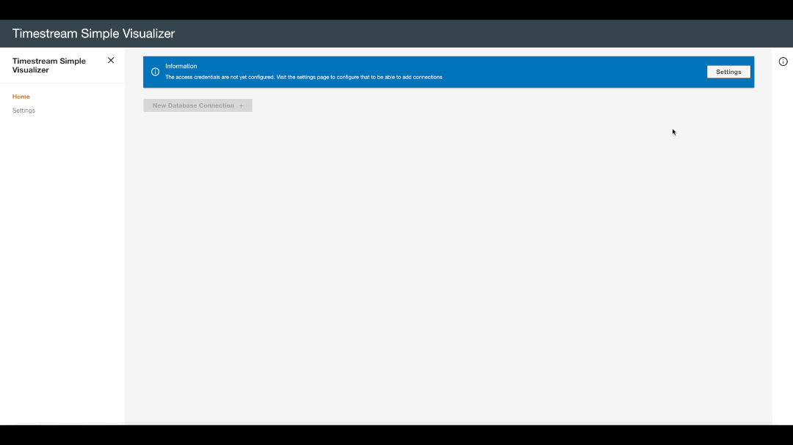
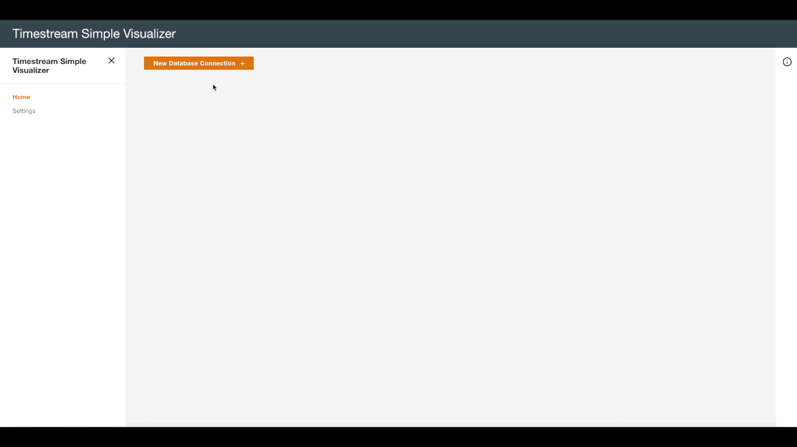

# Timestream Simple Visualizer

This small application allows you to connect to **Amazon Timestream** and visualize the data in a web UI. The project uses the following:

- [Create React App](https://github.com/facebook/create-react-app)
- [AWS NorthStar](https://github.com/aws/aws-northstar)
- [AWS SDK](https://github.com/aws/aws-sdk-js)
- [ECharts](https://github.com/apache/incubator-echarts)
- [Monaco Editor](https://github.com/Microsoft/monaco-editor)

## Requirements

You're required to have the following installed in your machine to be able to run the application:

- git
- Nodejs (v14.19.0 and above)
- AWS Account with Timestream readonly access and programmatic access (here a guide on [how to setup the account](docs/account-setup.md))

## Installation

You can run the application in your machine or deploy the build files in a hosting. This are the commands to execute the application locally:

```sh
git clone https://github.com/aws-samples/amazon-timestream-simple-visualizer.git
cd amazon-timestream-simple-visualizer
npm install # install dependencies
npm run start # run the application in debug
```

If the above commands are successful you'd be able to run the web application from the browser: http://localhost:3000

You could also serve the build version with the following:

```sh
npm run build
npx serve -s build
```

Which will serve the application from this URL: http://localhost:5000

Additionally, the build version can hosted and browsed remotely (eg. Using S3 and CloudFront).

## Usage

The application does provide a simple interface that you can use to add new visuals to represent the data available in Timestream. In the following sections there are few animated gifs that describe how to accomplish simple tasks.

- [Concepts](#concepts)
- [Settings](#settings)
- [Add New Database](#add-new-db)
- [Add New Table and visual](#add-new-table-and-visual)
- [Edit Visual](#edit-visual)
  - [Group interval](#group-interval)
  - [Filters](#filters)
  - [Multi Measures](#multi-measures)
  - [Custom Query](#custom-query)
  - [Automatic Refresh](#automatic-refresh)
  - [Visualization Interval](#visualization-interval)
- [Full Result](#full-result)

Note: Is highly suggested to have few tables in Timestream which you can use to read the data from. In this example we do refer mostly to the following:

- Data produced by the [AWS IoT Core and Timestream workshop](http://iot.awsworkshops.com/amazon-timestream/lab130-iotandtimestream/)
- IoT and DevOps sample DB available in the timestream console. [Follow this guide to create them](https://docs.aws.amazon.com/timestream/latest/developerguide/getting-started.db-w-sample-data.html)

### Concepts

The appliaction uses a simple naming convention with the following concepts:

- Database: Represent a connection to a database
- Table: Represent the table inside the database which has data (there could be more table in the same database)
- Visual: Represent a visual representation of the data in the table (there could be more visuals for the same table)

In addition, this document use the [standard concept of Timestream](https://docs.aws.amazon.com/timestream/latest/developerguide/concepts.html)

### Settings

After having configured the new AWS User in your AWS Account ([follow this guide for more details](docs/account-setup.md)) you can input the credentials inside the application settings.



**Note:** this settings are not saved anywhere, they just reside in memory and will be lost once you refresh your webpage.

### Add New DB

Once the settings are done the homepage will give you the option to add a new database connection.



You can add multiple database section or remove the one no longer relevant

### Add New Table and visual

On the database section has been added you can include a new table which will also provide an initial visual


### Edit Visual

When the visual is added into the list you're able to modify the graph by editing it's settings. This section highlight the additional settings that can be provided as part of the visual.

#### Group Interval

When you fetch a large number of data which represent measurement coming from different independent objects (eg. sensors, instances, devices, etc) would not be easy to visualise a pattern using only the visualization period.

This option allow you to **group the interval** for which you want visualize the data for (eg. 1 month of data with 1 datapoint every 5 minute) and aggregate the values in case the telemetry has a different frequency.


#### Filters

Additionally, filters on the dimensions can be added to narrow dow the measurement visualization to a group or an individual object (sensor, instance, device etc) that you're representing the timeseries data for.


#### Multi Measures

Multime measures can be added to the same graph (in case this will make sense) and displayed altogether. Something that could be useful in case you've to visualize data relative to a single object (sensor, instance, device etc)


This example shows also missing datapoint which leads the the gap in the graph.

#### Custom Query

When the UI does not allow you to customize the behaviour of the graph any further, you can actually create your own query and give it as input to **Timestream Simple Visualizer** to represent the data.

In this example we see how we can close the gaps that we have in the previous graph by using interpolation which is provided by **Amazon Timestream**. There are [multple timeseries function](https://docs.aws.amazon.com/timestream/latest/developerguide/timeseries-specific-constructs.functions.html) that can be used to interpolate the data. The query below uses a simple `INTERPOLATE_LINEAR`

The query editor shows the query generated automatically by the application and this can be updated by using a custom one such as:

```sql
WITH binned_timeseries AS (
    SELECT hostname, BIN(time, 30s) AS binned_timestamp, ROUND(AVG(measure_value::double), 2) AS avg_cpu_utilization
    FROM "SampleDevOpsDB"."DevOps"
    WHERE measure_name = 'cpu_utilization'
        AND hostname = 'host-Hovjv'
        AND time > ago(30d)
    GROUP BY hostname, BIN(time, 30s)
), memory_binned_timeseries AS (
    SELECT hostname, BIN(time, 30s) AS binned_timestamp, ROUND(AVG(measure_value::double), 2) AS avg_memory_utilization
    FROM "SampleDevOpsDB"."DevOps"
    WHERE measure_name = 'memory_utilization'
        AND hostname = 'host-Hovjv'
        AND time > ago(30d)
    GROUP BY hostname, BIN(time, 30s)
), interpolated_cpu_timeseries AS (
    SELECT hostname,
        INTERPOLATE_LINEAR(
            CREATE_TIME_SERIES(binned_timestamp, avg_cpu_utilization),
                SEQUENCE(min(binned_timestamp), max(binned_timestamp), 15s)) AS interpolated_avg_cpu_utilization
    FROM binned_timeseries
    GROUP BY hostname
), interpolated_memory_timeseries AS (
    SELECT hostname,
        INTERPOLATE_LINEAR(
            CREATE_TIME_SERIES(binned_timestamp, avg_memory_utilization),
                SEQUENCE(min(binned_timestamp), max(binned_timestamp), 15s)) AS interpolated_avg_memory_utilization
    FROM memory_binned_timeseries
    GROUP BY hostname
), cpu_join as (
  SELECT time, ROUND(value, 2) AS interpolated_cpu
  FROM interpolated_cpu_timeseries
  CROSS JOIN UNNEST(interpolated_avg_cpu_utilization)
), memory_join as (
  SELECT time, ROUND(value, 2) AS interpolated_memory
  FROM interpolated_memory_timeseries
  CROSS JOIN UNNEST(interpolated_avg_memory_utilization)
)
SELECT
  c.time, c.interpolated_cpu, m.interpolated_memory
FROM cpu_join c
INNER JOIN memory_join m on m.time = c.time
ORDER BY c.time DESC
```

Similary to the previous example this is getting memory and CPU usage data from a single host (`host-Hovjv`) but the difference is that in this case the missing gap are closed by interpolation


**Note**: Important to remember that the application require the custom query to return at least one field called **time** to be used as timestamp. If the field is missing the application will not be able to plot the data

#### Automatic Refresh

For this example the data generated by the [AWS IoT Core and Timestream workshop](http://iot.awsworkshops.com/amazon-timestream/lab130-iotandtimestream/) are used to demonstrate the automatic refresh feature. This allows you to define a visual that refresh itself at a defined frequency


#### Visualization Interval

The visualization interval can be quickly adjusted by using one of the various built-in values. To add a custom period the query can be modified to include a `where` condition on the timestamp.


### Full Result

Adding multiple visuals, tables and database connection and the full result will look more or less like this


### Limitations

- **Custom Query**: Custom query must contain at least one field called **time** to be able to represent the data in the graph
- **Multi Measures**: To display multiple measures is required to add a Group Interval and select an aggregation function

## Security

See [CONTRIBUTING](CONTRIBUTING.md#security-issue-notifications) for more information.

## License

This project is licensed under the Apache-2.0 License.
