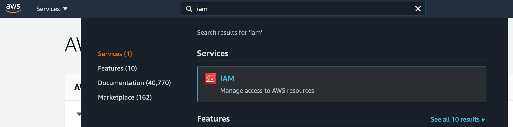
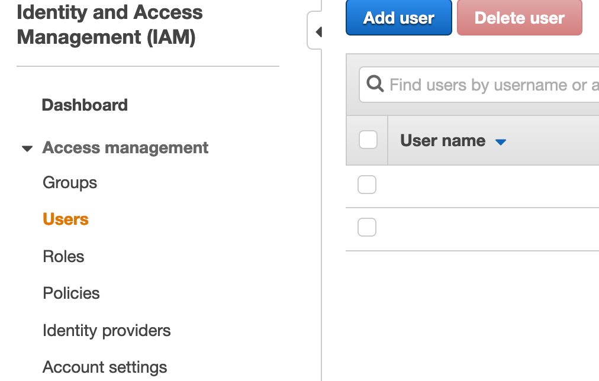
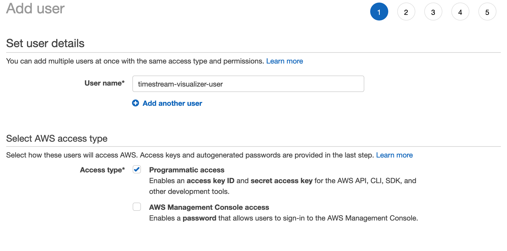
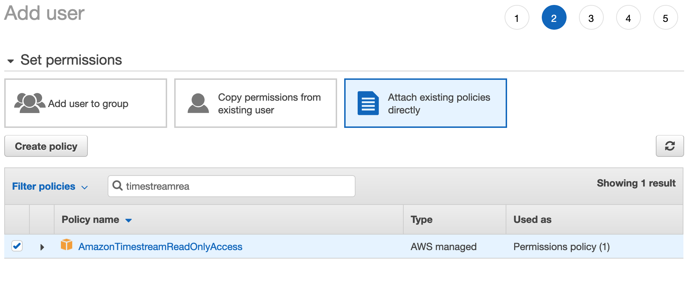
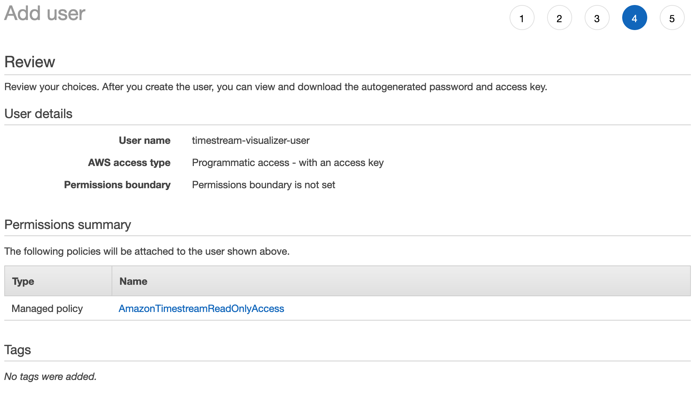
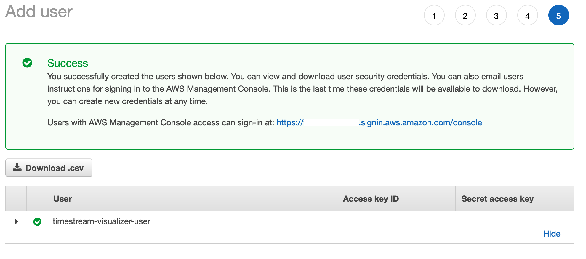

## Setup Account

In order to use **Timestream Simple Visualizer** you're required to have an account with programmatic access which has the right permissions to read from Timestream. This short guide highlight the steps required for you to get the account details to be used in the application.

## Setup

Follow the steps below to create an IAM User with programmatic access with readonly permission to **Amazon Timestream**. If you already know how to create users and attach policies to them, proceed by creating a user and attaching **AmazonTimestreamReadOnlyAccess** policy to it. Save the key and secret in order to be used in the application.

Otherwise, for the full details, follow the steps below.

1. From the **AWS Management Console** find _IAM_ and click to access it
   > 
2. On the left-hand side select **users** submenu and click on **Add User** button on the top of the page
   > 
3. in the new page give a name to the user that we're going to create (eg. _timestream-visualizer-user_) and check the option **Programmatic Access**. This will guarantee to generate for us the **Access Key** and **Secret Key** to be used into the application. We do not need this user to access the console, so do not select AWS Management Console Access. Thus click on _Next_
   > 
4. On the next step we need to setup the permissions for this user. We just need Amazon Timestream readonly access, and there's a managed policy that has this definition already in place for us. So we'll proceed by selecting **Attach Existing Policy directly** and on the search box type something so that we can look for **AmazonTimestreamReadOnlyAccess**. Thus select the policy as described and click on the next step.
   > 
5. The next step is relative to the tags, we gonna leave this empty so feel free to skip to the review step
6. If is all done correctly, this is how the new user will look like and we can proceed to create the user
   > 
7. Upon creation you will receive a confirmation page:
   > 

Remember to save the **Access Key ID** and **Secret Access Key** (or download the CSV file). The keys will be used in the application to read data and metadata from Timestream.
